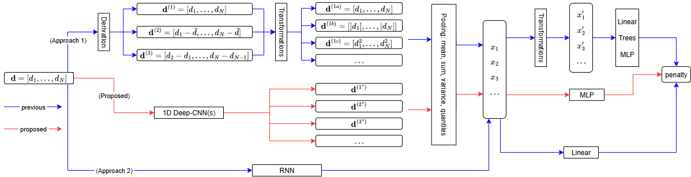

# OPART Penalty Learning using CNN
## Diagram


## Table
| Model | Feature Extraction | Training Speed | Citation |
|----------|----------|----------|----------|
| Approach 1 | Manual | Fast | `[1] [2] [3] [4]` |
| Approach 2 | Automatic | Slow | `[5]` |
| Proposed | Semi-automatic | Fast |  |
```
[1] Rigaill, G., Hocking, T.D., Bach, F., Vert, J.P., 2013.Learning Sparse Penalties for Change-Point Detection using Max Margin Interval Regression.URL: https://inria.hal.science/hal-00824075.

[2] Drouin, A., Hocking, T.D., Laviolette, F., 2017.Maximum margin interval trees, in: Proceedings of the 31st International Conference on Neural Information Processing Systems, Curran Associates Inc., Red Hook, NY, USA. p. 4954–4963.

[3] Barnwal, A., Cho, H., Hocking, T., 2022.Survival regression with accelerated failure time model in xgboost.Journal of Computational and Graphical Statistics 31, 1292–1302.

[4] Nguyen TL, Hocking TD. Penalty Learning for Optimal Partitioning using Multilayer Perceptron. Preprint arXiv:2408.00856

[5] Nguyen, Tung L., and Toby Hocking. "Learning Penalty for Optimal Partitioning via Automatic Feature Extraction." arXiv preprint arXiv:2505.07413 (2025).
```